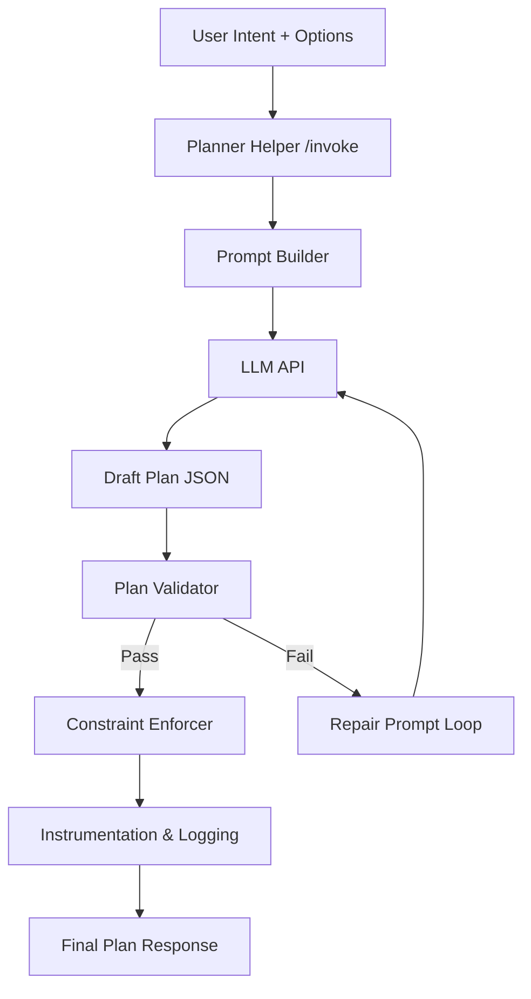

# Planner Helper PRD

## 1. Overview
The Planner Helper is an AMP-native tool that converts natural-language product intents into validated AMP Plan IR blueprints. It wraps an LLM but enforces schema, budget, evidence, and policy requirements before a plan reaches the kernel. The helper eliminates the current gap where product builders must hand-craft JSON plans or trust opaque, one-off LLM outputs.

## 2. Goals
- Enable PMs/product builders to request complex workflows by intent and receive executable AMP plans.
- Guarantee every generated plan includes signals (latency, cost, risk), stop conditions, evidence gates, and tool bindings consistent with registered ToolSpecs.
- Provide deterministic validation so “magic” LLM output is rejected and repaired automatically.
- Integrate with existing AMP components (ToolSpec ABI, plan validator, memory store) without bypassing guardrails.

## 3. Non-Goals
- Executing generated plans (kernel remains responsible).
- Replacing manual plan authoring entirely (humans can still edit/author plans).
- Maintaining a knowledge base of product requirements (handled via AMP memory or external tools).

## 4. Personas & Scenarios

### 4.1 Product Manager (Intent Author)
**Scenario**: PM enters “Design a pilot program for a neurodivergent-friendly ToDo app update.”
1. PM selects Planner Helper tool in the AMP console.
2. Provides intent + constraints (e.g., run within $5 cost cap, focus on existing memory insights).
3. Planner Helper returns a Plan IR with research, ideation, verification, and deployment nodes referencing registered tools. Signals include `cost_cap_usd: 5`, `latency_budget_ms: 20000`.
4. PM reviews evidence requirements and approves before executing via the kernel.

### 4.2 Engineer (Plan Reviewer)
**Scenario**: Engineer receives plan draft from PM.
1. Opens plan preview; sees each node annotated with the tool, budget contributions, and evidence policies.
2. Uses diff view to compare with previous plan iteration; Planner Helper produces deterministic, versionable JSON.
3. Runs `planner-helper verify` CLI to ensure plan still matches tooling constraints after manual edits.

### 4.3 Ops / Compliance (Audit)
**Scenario**: Compliance checks that Planner Helper enforces budgets.
1. Runs test harness scenarios (section 10) to prove generated plans always include signals and evidence steps.
2. Reviews Planner Helper logs showing validation errors and repairs before plan release.

## 5. Functional Requirements
1. **ToolSpec Exposure**: Planner Helper is a ToolSpec (`planner.helper`) exposing `/spec` and `/invoke` via AMP’s adapter layer.
2. **Input Schema**: Accepts intent description, optional structured requirements, target cost/latency budgets, required tools/capabilities, and memory references.
3. **Output Schema**:
   - Valid Plan IR JSON adhering to `schemas/Plan.schema.json`.
   - Must populate `signals.latency_budget_ms`, `signals.cost_cap_usd`, optional `signals.risk`.
   - Ensure `stop_conditions.max_nodes` and `stop_conditions.min_confidence` present.
   - Every node either references a registered tool (`tool`) or declares a `capability` resolvable via ToolSpecs.
4. **Validation Pipeline**:
   - Run AMP `Plan::validate` on LLM output.
   - Verify required signals/stop conditions with custom checks.
   - Confirm referenced tools exist in registry and satisfy policy fields (provenance, attribution).
   - If validation fails, auto-generate a repair prompt to the LLM and retry (configurable max retries).
   - Provide detailed error payload when final result fails.
5. **Budget & Constraint Injection**:
   - Optionally fetch ToolSpecs to compute estimated cost/latency and adjust plan-level signals.
   - If user supplies budgets, enforce them; if not, set defaults derived from ToolSpecs.
6. **Evidence Enforcement**:
   - Insert `verify`/`assert` nodes ensuring key outputs meet minimum confidence.
   - If the intent references memory updates, include `mem.write` nodes with evidence thresholds.
7. **Observability**:
   - Log raw LLM prompt, output hash, validation results, repairs attempted, and final plan ID.
   - Store logs with execution trace IDs for replay.
8. **User Interfaces**:
   - CLI command `ampctl planner-helper draft --intent file.json`.
   - Optional web UI module (future) to render plan preview.

## 6. Non-Functional Requirements
- **Determinism**: Same intent + tool registry should yield identical plan within tolerance (random seeds fixed).
- **Latency**: Target < 8 seconds end-to-end for typical plans (LLM latency dominated).
- **Security**: No external network calls beyond configured LLM endpoint; redact sensitive memory data before sending to LLM.
- **Reliability**: 99% success rate without manual repair (per harness metrics).

## 7. Dependencies
- AMP ToolSpec ABI and adapter framework (`adapters/src/common/toolshim.ts`).
- Tool registry (file or service) enumerating available tools with endpoint URLs.
- AMP Plan schemas (`schemas/Plan.schema.json`) and validator (`Plan::validate`).
- Evidence verifier (`kernel/src/internal/evidence/verify.rs`) to compute thresholds referenced.
- Memory store for retrieving prior insights (optional).
- LLM provider (Claude, GPT, etc.) accessible via configured endpoint.

## 8. Architecture



### Components
- **Prompt Builder**: Injects schema, tool catalog, exemplar plans, and explicit requirements into LLM prompt. Handles privacy filters for memory data.
- **Plan Validator**: Runs schema validation, tool existence checks, evidence checks, custom budget assertions, and ensures node uniqueness/dependency correctness.
- **Constraint Enforcer**: Adds/normalizes budgets, ensures stop conditions present, optionally calls ToolSpec analyzer to estimate cost/latency contributions per node.
- **Repair Loop**: On validation failure, feeds error details back to LLM with diff instructions. Max retry count (default 2). Emits failure report if unresolved.
- **Instrumentation**: Logs all prompts, outputs, validation events, and returns run metadata to users/ops.

## 9. Interfaces (ToolSpec)

### 9.1 `/spec`
```json
{
  "name": "planner.helper",
  "description": "Generates validated AMP plans from natural-language intents",
  "io": {
    "input": {
      "type": "object",
      "properties": {
        "intent": {"type": "string"},
        "constraints": {"type": "object"},
        "required_tools": {"type": "array", "items": {"type": "string"}},
        "memory_context": {"type": "array", "items": {"type": "string"}},
        "budgets": {
          "type": "object",
          "properties": {
            "latency_ms": {"type": "integer"},
            "cost_usd": {"type": "number"},
            "risk": {"type": "number"}
          }
        }
      },
      "required": ["intent"]
    },
    "output": {
      "type": "object",
      "properties": {
        "plan": {"$ref": "https://.../Plan.schema.json"},
        "validation": {
          "type": "object",
          "properties": {
            "status": {"type": "string", "enum": ["passed", "failed"]},
            "errors": {"type": "array", "items": {"type": "string"}}
          }
        },
        "telemetry_id": {"type": "string"}
      },
      "required": ["plan", "validation"]
    }
  },
  "constraints": {
    "latency_p50_ms": 8000,
    "cost_per_call_usd": 0.05
  }
}
```

### 9.2 `/invoke`
- Accepts JSON matching the input schema.
- Returns `plan` only if validation status is `passed`; otherwise returns error list explaining unmet requirements.

## 10. Test Harness

### 10.1 Objectives
- Validate that generated plans meet structural requirements, reference existing tools, include budgets, and insert evidence/memory guardrails.
- Surface deterministic metrics: success rate, average repair attempts, latency, token usage.

### 10.2 Harness Design
- Implement as a Rust integration suite (`kernel/tests/planner_helper_tests.rs`) or standalone binary.
- Use curated intent fixtures (e.g., `fixtures/intents/*.json`) covering: simple CRUD workflow, multi-agent research & delivery, memory write scenarios, high-risk operations requiring strict evidence.
- For each fixture:
  1. Call Planner Helper tool via HTTP.
  2. Assert `validation.status == "passed"`.
  3. Deserialize plan; run `Plan::validate`.
  4. Check `signals`, `stop_conditions`, `verify` nodes, and tool references.
  5. Cross-reference tool URLs via registry; ensure they exist.
  6. Compute estimated budget using `ConstraintChecker`; ensure within declared constraints.
  7. Optionally execute plan in dry-run mode (tools mocked) to ensure step ordering and variable bindings.
- Generate report summarizing pass/fail per scenario, average repair attempts, mean latency.

### 10.3 CLI
Add command `ampctl planner-helper verify --fixtures fixtures/intents` to run harness. Report results as JSON or table.

## 11. MVP Scope & Timeline
- **Week 1**: ToolSpec scaffolding, prompt builder with schema/examples, initial validation pipeline.
- **Week 2**: Repair loop, budget/evidence enforcement, instrumentation, CLI integration.
- **Week 3**: Test harness, fixture suite, docs, developer onboarding guide.
- Stretch: web UI preview module.

## 12. Risks & Mitigations
- **LLM hallucination of tool names** → Mitigate by injecting registry list into prompt and post-validating against registry.
- **Budget misestimation** → Use ToolSpec constraints as heuristics; flag low confidence to user.
- **Latency spikes** → Cache prompt scaffolding, enable streaming; allow fallback to manual editing when LLM unavailable.
- **Security/leakage** → Redact sensitive memory; maintain allowlist of fields when sending context to LLM.

## 13. Open Questions
- Which LLM(s) should we support first? (Claude, GPT-4o, self-hosted?).
- Should Planner Helper persist generated plans automatically in AMP memory for future reuse?
- How do we expose editing UX (visual DAG vs JSON editor) post-generation? (outside MVP scope).

## 14. Success Metrics
- ≥95% of intents produce valid plans after ≤1 repair attempt (measured in test harness).
- 50% reduction in manual plan authoring time in pilot teams.
- Zero production runs using unvalidated LLM output (every plan passes harness checks).
- Positive PM NPS regarding clarity of generated plans (qualitative feedback).

