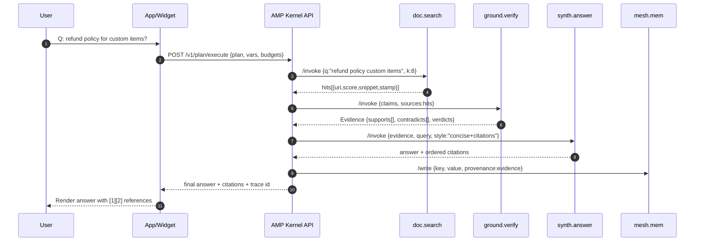

# Verified Answers Wedge — AMP Use Case Technical Spec v1

> **Purpose:** Specify a concrete, reproducible "Verified Answers" implementation using AMP inside an existing system. This document is **technical and precise**, with end-to-end flows, schemas, example citations, budgets, traces, and validation gates.

---

## 1) Scope & Problem
**Scope:** A drop-in service that returns **grounded, cited answers** from tenant documents with **budget control** (latency/cost) and **auditable self-evolution**.

**Problem:** Current bots answer fast but **can’t prove**; RAG pipelines are brittle, hard to audit, and cost/latency drift. We need a minimal, portable way to guarantee **evidence**, **SLOs**, and **safe adaptation**.

**Non-goals:** Replace your framework (LangChain/LlamaIndex/MCP) — AMP **layers** on top as a contract and runtime.

---

## 2) Concrete Scenario
**Tenant:** "Acme Tools" (SME).  
**Question:** *“What is your refund policy for custom items?”*  
**Sources:**
- `https://docs.acme.example/policies/refunds.html` (updated `2025-07-18`)
- `https://docs.acme.example/policies/custom-items.pdf` (updated `2025-08-02`)
- `https://support.acme.example/tickets/34219` (customer escalation referencing edge case)

**Expected answer (structure):** short claim + explicit exceptions + **citations**; block or hedge if evidence < policy.

---

## 3) High-Level Flow


---

## 4) Contracts (Schemas & ToolSpecs)

### 4.1 ToolSpec: `doc.search`
```json
{
  "type": "ToolSpec",
  "id": "doc.search",
  "io": {
    "input": {"q": {"type":"string"}, "k": {"type":"integer","default": 8}, "filters": {"type":"object"}},
    "output": {"hits": {"type":"array","items": {"id":"string","uri":"string","score":"number","snippet":"string","stamp":"string"}}}
  },
  "constraints": {"input_tokens_max": 512, "latency_p50_ms": 120, "cost_per_call_usd": 0.0001, "rate_limit_qps": 50, "side_effects": false},
  "provenance": {"attribution_required": true}
}
```

### 4.2 ToolSpec: `ground.verify`
```json
{
  "type": "ToolSpec",
  "id": "ground.verify",
  "io": {
    "input": {"claims": {"type": "array", "items": "string"}, "sources": {"type": "array", "items": "Hit"}, "min_confidence": {"type": "number", "default": 0.90}},
    "output": {"evidence": "Evidence"}
  },
  "constraints": {"latency_p50_ms": 200, "cost_per_call_usd": 0.0008, "side_effects": false}
}
```

### 4.3 Evidence object
```json
{
  "type": "Evidence",
  "claims": ["Refund policy for custom items"],
  "supports": [
    {"claim":"Refund policy for custom items","source":"https://docs.acme.example/policies/refunds.html#custom","confidence":0.93,
     "snippet":"Custom items are non‑refundable except for manufacturing defects within 30 days."}
  ],
  "contradicts": [
    {"claim":"Refund policy for custom items","source":"https://support.acme.example/tickets/34219","weight":0.18,
     "snippet":"Agent approved refund for a custom order after 45 days."}
  ],
  "policy": {"cite_if_confidence_below": 0.95, "block_if_conflict_over": 0.30},
  "verdict": {"confidence": 0.91, "needs_citation": true}
}
```

### 4.4 ToolSpec: `synth.answer`
```json
{
  "type": "ToolSpec",
  "id": "synth.answer",
  "io": {
    "input": {"query":"string","evidence":"Evidence","style":{"type":"string","enum":["concise+citations"]}},
    "output": {"text":"string","citations":{"type":"array","items":{"uri":"string","title":"string"}}}
  },
  "constraints": {"latency_p50_ms": 140, "cost_per_call_usd": 0.0012}
}
```

### 4.5 ToolSpec: `mesh.mem`
```json
{
  "type": "ToolSpec",
  "id": "mesh.mem",
  "io": {"input": {"op":{"type":"string","enum":["read","write"]},"key":"string","value":"object","provenance":"Evidence","ttl":"string"},
          "output": {"ok":"boolean"}},
  "constraints": {"latency_p50_ms": 60, "side_effects": true}
}
```

---

## 5) Plan IR (Executable Example)
```json
{
  "plan_id": "acme.refund.v1",
  "signals": {"latency_budget_ms": 1500, "cost_cap_usd": 0.02, "risk": "low"},
  "nodes": [
    {"id":"n1","op":"call","tool":"doc.search","args":{"q":"refund policy custom items","k":8},"out":"hits1"},
    {"id":"n2","op":"call","tool":"ground.verify","args":{"claims":["Refund policy for custom items"],"sources":"$hits1","min_confidence":0.90},"out":"ev1"},
    {"id":"n3","op":"assert","if":"$ev1.verdict.confidence >= 0.90"},
    {"id":"n4","op":"call","tool":"synth.answer","args":{"query":"$INPUT.query","evidence":"$ev1","style":"concise+citations"},"out":"ans"},
    {"id":"n5","op":"mem.write","tool":"mesh.mem","args":{"op":"write","key":"faq.refunds.custom","value":"$ans","provenance":"$ev1","ttl":"P180D"}}
  ],
  "edges": [["n1","n2"],["n2","n3"],["n3","n4"],["n4","n5"]],
  "stop_conditions": {"max_nodes": 10}
}
```

---

## 6) Example Answer (Rendered to User)
> **Answer:** Custom items are **non‑refundable**, except for **manufacturing defects within 30 days**. If a defect is confirmed, contact support to initiate a replacement or refund. [1][2]
>
> **References:**  
> [1] *Refund Policy → Custom Items*, `docs.acme.example/policies/refunds.html#custom` (updated 2025‑07‑18).  
> [2] *Custom Items Exceptions*, `docs.acme.example/policies/custom-items.pdf` (updated 2025‑08‑02).

**Policy behavior:** Because `evidence.verdict.confidence = 0.91 < cite_if_confidence_below 0.95`, **citations are mandatory**.

---

## 7) Citations in the API Response
```json
{
  "text": "Custom items are non‑refundable, except for manufacturing defects within 30 days. [1][2]",
  "citations": [
    {"uri":"https://docs.acme.example/policies/refunds.html#custom","title":"Refund Policy → Custom Items","stamp":"2025-07-18T10:15:00Z"},
    {"uri":"https://docs.acme.example/policies/custom-items.pdf#exceptions","title":"Custom Items Exceptions","stamp":"2025-08-02T09:00:00Z"}
  ],
  "evidence": {"confidence": 0.91, "contradictions": 0.18, "needs_citation": true},
  "trace_id": "t_9f1c…"
}
```

---

## 8) Budgets & Constraint Algebra (Concrete)
- **Budgets (per request):** `latency_budget_ms = 1500`, `cost_cap_usd = 0.02`.
- **Consumption (expected):**
  - `doc.search`: ~120ms / $0.0001
  - `ground.verify`: ~200ms / $0.0008
  - `synth.answer`: ~140ms / $0.0012
  - `mesh.mem.write`: ~60ms / $0.0000X
- **Check:** Σ latency p50 ≈ **520ms** (≤ 1500ms); Σ cost ≈ **$0.0021** (≤ $0.02) → **OK**.  
If predicted Σ exceeds budgets, planner reduces `k`, switches to breadth‑then‑depth, or serves a **degraded** cited summary.

---

## 9) Observability (Trace Example)
```json
{
  "plan_id": "acme.refund.v1",
  "step": "n2",
  "ts_start": "2025-09-25T09:04:10Z",
  "ts_end": "2025-09-25T09:04:11Z",
  "inputs_hash": "blake3:…",
  "outputs_hash": "blake3:…",
  "cost_usd": 0.0008,
  "tokens_in": 410,
  "tokens_out": 230,
  "citations": [
    "https://docs.acme.example/policies/refunds.html#custom",
    "https://docs.acme.example/policies/custom-items.pdf#exceptions"
  ],
  "sig": "ed25519:…"
}
```

**SLO dashboard (minimum):** GQS, citation rate, contradiction rate, p50/p95, cost/answer; drill‑down by intent and time.

---

## 10) Self‑Evolution Hooks (Verified Answers)
```mermaid
flowchart TD
  A[Observe SLOs] -->|citation < 90% or contradictions > 3%| B[Critic]
  B --> C[Change‑Proposal]
  C --> D[Shadow/A‑B Validation]
  D -->|pass| E[Auto‑apply (Low risk)]
  D -->|fail| F[Rollback/Reject]
  E --> G[Signed change log + Replay]
```

**Adjustable knobs (low risk):** retrieval `k`, rerank on/off, citation threshold, contradiction tolerance, cache TTL, freshness bias.

**Validation gates (examples):**
- `GQS +≥8%` absolute **or** `p95 −35%` at cost `≤ +10%`.
- Citation rate ≥ 90%; contradictions ≤ 3% on validation slice.

---

## 11) Integration (Existing Systems)
**Kernel API (HTTP):**
- `POST /v1/plan/execute` → `{ plan, vars, budgets }` → `{ plan_id, stream_url }`
- `GET /v1/trace/{plan_id}` → SSE/NDJSON stream of trace events
- `POST /v1/replay/bundle` → tarball (plan + specs + traces)

**Adapter contract:** Every tool exposes:
- `GET /spec` → ToolSpec JSON
- `POST /invoke` → `{ args }` → `{ result }`

**Widget/API usage (example):**
```http
POST /v1/plan/execute
{
  "plan": {"ref": "acme.refund.v1"},
  "vars": {"query": "refund policy custom items"},
  "budgets": {"latency_budget_ms": 1500, "cost_cap_usd": 0.02}
}
```

---

## 12) Deployment & Validation Plan
1) **Seed sources** (Drive/Notion/S3/website).  
2) **Run baseline** (existing bot) on 175‑item set; record citations, contradictions, p95, cost.  
3) **Run AMP plan**; compute **GQS**, citation rate, contradictions, p95, cost.  
4) **Self‑evolve** if SLO breach; validate with Shadow/A‑B; auto‑apply low risk.  
5) **Publish audit**: before/after table + replay bundle.

**Acceptance (must pass):**
- Citation ≥ **90%**, contradictions ≤ **3%**.  
- At least one **p95 −35%** improvement in validation.  
- Cost/verified answer ≤ baseline **±10%** after cache warm‑up.

---

## 13) Security, Privacy, Compliance
- Tenant‑scoped indexes/memory; provenance attached to all writes.  
- TTL + right‑to‑forget; fail‑closed when evidence < policy.  
- Signed traces; exportable NDJSON; reproducible replay.

---

## 14) Appendix: Sample Data
### 14.1 Search hits (abridged)
```json
{
  "hits": [
    {"id":"h1","uri":"https://docs.acme.example/policies/refunds.html#custom","score":0.71,
     "snippet":"Custom items are non‑refundable except for manufacturing defects within 30 days."},
    {"id":"h2","uri":"https://docs.acme.example/policies/custom-items.pdf#exceptions","score":0.65,
     "snippet":"Exceptions apply to manufacturing defects; contact support within 30 days."}
  ]
}
```

### 14.2 Evidence (full)
```json
{
  "claims":["Custom items refund policy"],
  "supports":[{"claim":"Custom items refund policy","source":"https://docs.acme.example/policies/refunds.html#custom","confidence":0.93}],
  "contradicts":[{"claim":"Custom items refund policy","source":"https://support.acme.example/tickets/34219","weight":0.18}],
  "verdict":{"confidence":0.91,"needs_citation":true}
}
```

### 14.3 Final answer payload
```json
{
  "text":"Custom items are non‑refundable, except for manufacturing defects within 30 days. [1][2]",
  "citations":[
    {"uri":"https://docs.acme.example/policies/refunds.html#custom","title":"Refund Policy → Custom Items"},
    {"uri":"https://docs.acme.example/policies/custom-items.pdf#exceptions","title":"Custom Items Exceptions"}
  ],
  "evidence":{"confidence":0.91,"contradictions":0.18},
  "budget_used":{"latency_ms":540,"cost_usd":0.0021},
  "trace_id":"t_9f1c…"
}
```

---

## 15) Notes for Engineering
- Keep **tool specs stable**; treat them as ABI surfaces.  
- Prefer **breadth‑then‑depth** retrieval when budget‑tight.  
- Cache **fast paths** by intent (FAQ heads); evict via **LFU** with age factor.  
- Always propagate **policy thresholds** to `ground.verify` (min confidence, contradiction bounds).  
- For regulated domains, set **needs_citation=true** regardless of confidence.

